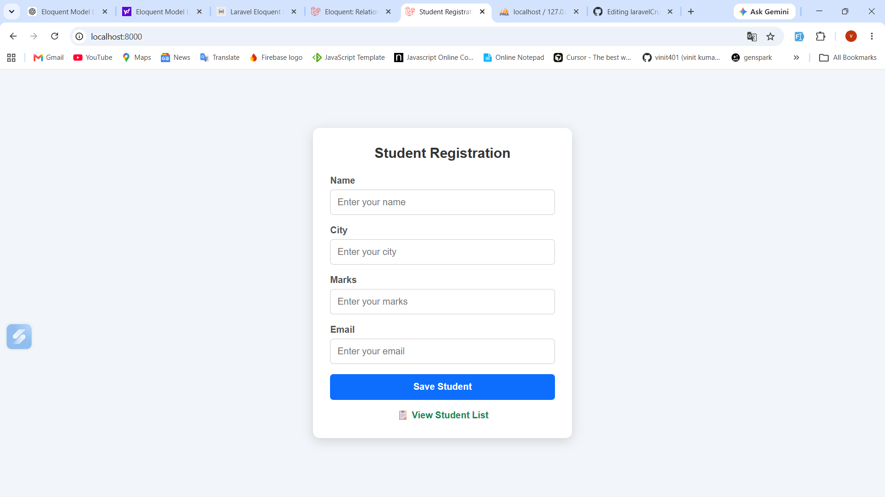
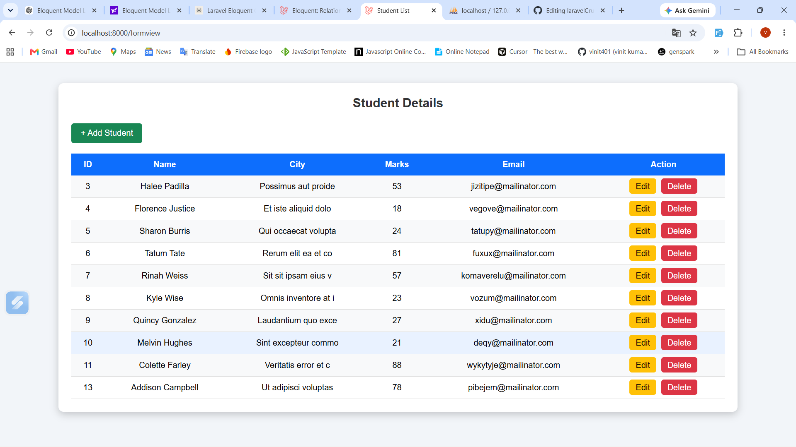
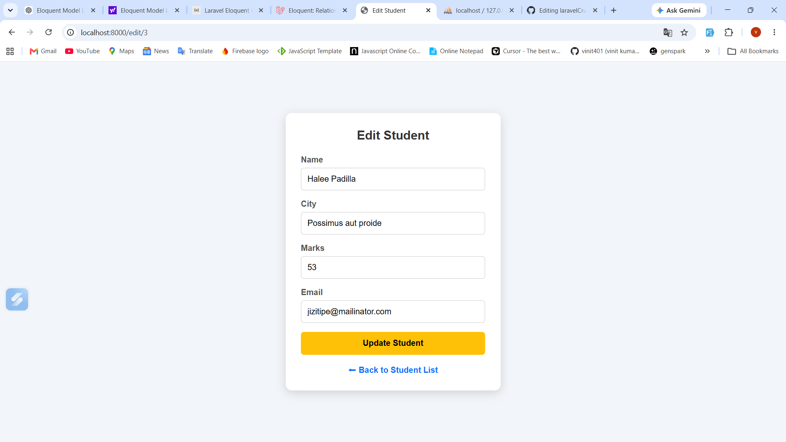

# 🎓 Laravel CRUD Application
<p align="center">
<a href="https://laravelcrud.rf.gd">

</a>

<a href="https://github.com/vinit401/laravelCrud">

</a>
</p>

<p align="center">
  
</p>

<p align="center">
  
  
  
  
  
</p>

---

# 📖 About Project

This project is a **Student Management System** developed using **Laravel 12** and **Eloquent ORM**.

It demonstrates complete CRUD (Create, Read, Update and Delete) operations while following Laravel's MVC architecture.

The project also includes a clean, modern and responsive user interface for better user experience.

---

# ✨ Features

* ✅ Create Student
* ✅ View Student List
* ✅ Update Student Information
* ✅ Delete Student
* ✅ Responsive Design
* ✅ Laravel Routing
* ✅ Controllers
* ✅ Blade Templates
* ✅ Eloquent ORM
* ✅ MySQL Database
* ✅ Database Migration
* ✅ CSRF Protection
* ✅ MVC Architecture

---

# 🛠 Tech Stack

* Laravel 12
* PHP 8.2
* MySQL
* Blade Template Engine
* HTML5
* CSS3
* Eloquent ORM

---

# 📂 Project Structure

```
app/
database/
resources/
routes/
public/
config/
```

---

# 🚀 Learning Outcomes

Through this project I learned:

* Laravel Project Structure
* MVC Architecture
* Routing
* Controllers
* Blade Templates
* Eloquent ORM
* CRUD Operations
* Database Migrations
* Form Handling
* Responsive UI Design

---

# 📱 Project Features

✔ Responsive User Interface

✔ Mobile Friendly Design

✔ Student Registration

✔ Student Listing

✔ Edit Student Details

✔ Delete Student

✔ Professional Dashboard Style

---

# 📸 Project Preview

## 🏠 Student Registration


<p align="center">
  
</p>

## 📋 Student List

<p align="center">
  
</p>

## ✏️ Edit Student

<p align="center">
  
</p>

---

# 📦 Installation

```bash
git clone https://github.com/vinit401/laravelCrud.git

cd laravelCrud

composer install

cp .env.example .env

php artisan key:generate

php artisan migrate

php artisan serve
```

---

# 👨‍💻 Developer

**Vinit Kumar Shah**

MCA Student | PHP & Laravel Developer

---

## 🌐 Connect With Me

💼 GitHub

https://github.com/vinit401

🔗 Repository

https://github.com/vinit401/laravelCrud

💼 LinkedIn

https://www.linkedin.com/in/vinit-kumar-shah/

---

# ⭐ If you like this project

Give this repository a ⭐ on GitHub.

It motivates me to build more Laravel projects.

---

<p align="center">
Made with ❤️ using Laravel 12 by <strong>Vinit Kumar Shah</strong>
</p>
